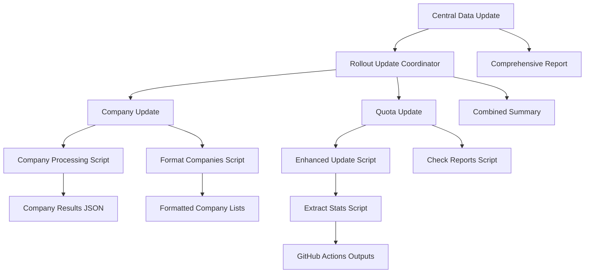

# GitHub Actions Workflow Architecture Documentation

## 📋 Overview

This document describes the modular GitHub Actions workflow architecture for VNBdigitaler's automated data update system. The architecture has been restructured to provide clear separation of concerns, better maintainability, and enhanced reporting capabilities.

## 🏗️ Architecture Structure

```
📁 .github/workflows/
├── 🔄 central-data-update.yml               # Main Orchestrator
├── 📊 reusable-rollout-update.yml           # Rollout Coordinator
├── 🏢 reusable-rollout-company-update.yml   # Company Management
├── 📈 reusable-rollout-quota-update.yml     # Quota Processing
└── 🧪 ci.yml                               # Continuous Integration

📁 .github/scripts/
├── 🔍 check_reports.py                     # BNetzA Report Checker
├── ⚡ enhanced_update.py                   # Enhanced Update Runner
├── 📊 extract_stats.py                     # Statistics Extractor
└── 📋 format_companies.py                  # Company List Formatter
```

## 🔄 Workflow Hierarchy

### 1. Central Data Update (Orchestrator)

**File**: `central-data-update.yml`
**Purpose**: Main entry point for all automated data updates
**Triggers**:

- 📅 Scheduled daily at 6:00 UTC (8:00 CEST)
- 🔧 Manual dispatch with configurable options

**Responsibilities**:

- Orchestrates all data update workflows
- Provides unified configuration interface
- Creates comprehensive summary reports
- Handles system-wide failure notifications
- Issues automatic GitHub issues for failed scheduled runs

**Inputs**:

- `update_type`: Which update to run (all, rollout-quotas, bdew-companies, check-only)
- `force_update`: Force update even if no changes detected
- `dry_run`: Show what would be updated without making changes

### 2. Rollout Update Coordinator

**File**: `reusable-rollout-update.yml`
**Purpose**: Coordinates BNetzA rollout data updates
**Called by**: Central Data Update

**Responsibilities**:

- Manages the execution order of company and quota updates
- Coordinates parallel execution where possible
- Combines results from sub-workflows
- Creates unified rollout update summary

**Sub-workflows**:

1. Company Update (parallel with quota update when possible)
2. Quota Update (depends on company update completion)

### 3. Company Update Workflow

**File**: `reusable-rollout-company-update.yml`
**Purpose**: Manages BNetzA rollout company data
**Called by**: Rollout Update Coordinator

**Responsibilities**:

- Downloads and processes BNetzA company data
- Performs string-based company matching
- Creates new company entries as needed
- Reports on matched, unmatched, and new companies
- Generates company update artifacts

**Outputs**:

- `companies_processed`: Total number of companies processed
- `companies_updated`: Number of existing companies updated
- `companies_new`: Number of new companies added
- `companies_matched`: Number of successfully matched companies
- `companies_unmatched`: Number of companies that couldn't be matched

**Features**:

- ✅ Workflow structure complete
- ✅ GitHub Actions integration
- ✅ Basic statistics and outputs
- 🔄 String-based matching (placeholder implemented)
- 📋 Detailed reporting capabilities

### 4. Quota Update Workflow

**File**: `reusable-rollout-quota-update.yml`
**Purpose**: Processes BNetzA rollout quota data
**Called by**: Rollout Update Coordinator

**Responsibilities**:

- Downloads latest BNetzA rollout reports
- Processes quota data and statistics
- Updates database with new quota information
- Validates quota data integrity
- Creates detailed quota reports

**Outputs**:

- `quotas_total`: Total number of quota records
- `quotas_current_date`: Number of quotas with current date
- `quotas_outdated_date`: Number of quotas with outdated date
- `quotas_errors`: Number of quota validation errors

## 🔧 Supporting Scripts

### Python Scripts in `.github/scripts/`

#### 1. `check_reports.py`

**Purpose**: Check for new BNetzA reports
**Usage**: Called by quota update workflow
**Features**:

- Checks BNetzA website for new rollout reports
- Sets GitHub Actions outputs for availability
- Handles network errors gracefully

#### 2. `enhanced_update.py`

**Purpose**: Enhanced rollout updater with JSON output
**Usage**: Main rollout processing script
**Features**:

- Supports both force-update and regular modes
- Parses detailed summary information
- Creates JSON output for GitHub Actions
- Enhanced error handling and logging

#### 3. `extract_stats.py`

**Purpose**: Extract statistics from JSON summaries
**Usage**: Processes update results for GitHub Actions
**Features**:

- Parses JSON summary files
- Sets GitHub Actions output variables
- Fallback extraction from text logs
- Comprehensive error handling

#### 4. `format_companies.py`

**Purpose**: Format company lists for summaries
**Usage**: Creates formatted company breakdowns
**Features**:

- Formats company lists with pagination
- Handles large lists with truncation
- Creates markdown-formatted output
- Constants for maintainable display limits

## 📊 Data Flow



## 🎯 Configuration Options

### Input Parameters

| Parameter | Type | Description | Default | Available In |
|-----------|------|-------------|---------|--------------|
| `update_type` | choice | Which update to run | `all` | Central Update |
| `force_update` | boolean | Force update regardless of changes | `false` | All workflows |
| `dry_run` | boolean | Simulate without making changes | `false` | All workflows |
| `check_only` | boolean | Only check for updates | `false` | Update workflows |

### Environment Variables

| Variable | Purpose | Required | Scope |
|----------|---------|----------|-------|
| `DATABASE_URL` | Database connection string | Yes | All update workflows |
| `GITHUB_OUTPUT` | GitHub Actions output file | Auto | All scripts |
| `GITHUB_STEP_SUMMARY` | GitHub Actions summary file | Auto | Summary generation |

## 📈 Monitoring and Reporting

### Summary Reports

Each workflow level provides detailed summaries:

1. **Central Level**: Overall system status and next steps
2. **Coordinator Level**: Combined rollout update results
3. **Component Level**: Specific component statistics and details

### Artifacts Generated

| Workflow | Artifact | Content | Retention |
|----------|----------|---------|-----------|
| Company Update | `company-update-results` | Company processing results JSON | 30 days |
| Quota Update | `rollout-update-results` | Update summary and output logs | 30 days |
| All (on failure) | `error-logs` | Error logs and debug information | 7 days |

### Failure Handling

#### Automatic Issue Creation

- **Trigger**: Scheduled run failures
- **Content**: Comprehensive diagnostic information
- **Labels**: `bug`, `automation`, `data-update`, `system-failure`, `priority-critical`
- **Escalation**: Includes recovery procedures and contact information

#### Error Recovery

- **Immediate**: Next scheduled run in 24 hours
- **Manual**: Workflow dispatch with diagnostic parameters
- **Emergency**: WebUI manual update capabilities

## 🔄 Development Workflow

### Making Changes

1. **Script Updates**: Modify scripts in `.github/scripts/`
2. **Workflow Updates**: Update YAML files in `.github/workflows/`
3. **Testing**: Use `workflow_dispatch` with `dry_run: true`
4. **Validation**: Check GitHub Actions outputs and summaries

### Testing Strategy

1. **Component Testing**: Test individual workflows in isolation
2. **Integration Testing**: Test full workflow chain
3. **Failure Testing**: Verify error handling and recovery
4. **Performance Testing**: Monitor execution times and resource usage

### Best Practices

1. **Modularity**: Keep workflows focused on single responsibilities
2. **Error Handling**: Implement comprehensive error catching
3. **Logging**: Provide detailed logging for debugging
4. **Documentation**: Update documentation with changes
5. **Versioning**: Use semantic versioning for major changes

## 🚀 Future Enhancements

### Planned Features

#### Company Management

- [ ] Advanced fuzzy matching algorithms
- [ ] Manual company linking interface
- [ ] Company deduplication logic
- [ ] Historical company tracking

#### BDEW Integration

- [ ] BDEW company data source integration
- [ ] Automated BDEW-Rollout company linking
- [ ] BDEW data validation and enrichment
- [ ] Company information merging

#### Monitoring Improvements

- [ ] Performance metrics collection
- [ ] Data quality scoring
- [ ] Trend analysis and alerting
- [ ] Dashboard integration

#### Workflow Enhancements

- [ ] Conditional execution based on data freshness
- [ ] Retry mechanisms with exponential backoff
- [ ] Advanced parallel processing
- [ ] Resource optimization

## 📞 Support and Troubleshooting

### Common Issues

#### Workflow Failures

1. **Check logs**: Review detailed logs in GitHub Actions
2. **Verify secrets**: Ensure DATABASE_URL is correctly configured
3. **Test connectivity**: Verify database and external service access
4. **Manual retry**: Use workflow_dispatch with appropriate parameters

#### Data Quality Issues

1. **Validation errors**: Check quota validation error details
2. **Missing companies**: Review unmatched company reports
3. **Stale data**: Verify last successful update timestamp
4. **Integration problems**: Check WebUI data consistency

### Monitoring Checklist

- [ ] Daily workflow execution status
- [ ] Error rate trends
- [ ] Data freshness indicators
- [ ] System performance metrics
- [ ] Integration health checks

### Contact Information

- **Repository**: [GitHub Repository](https://github.com/your-org/vnbdigitaler)
- **Issues**: [GitHub Issues](https://github.com/your-org/vnbdigitaler/issues)
- **WebUI**: [VNBdigitaler Dashboard](https://your-webui-url.com)
- **Documentation**: [Project Documentation](https://your-docs-url.com)

---

*Last Updated: August 2025*
*Version: 2.0*
*Author: VNBdigitaler Development Team*
