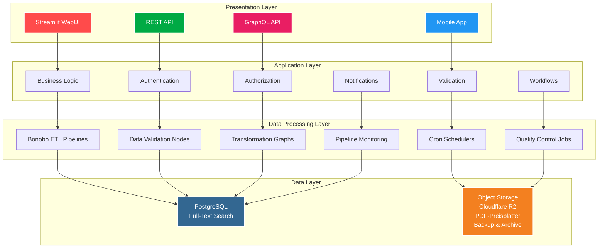

# VNB Digitaler - Projektspezifikation

> **📋 Projekt-Roadmap**: [ROADMAP.md](./ROADMAP.md) - Phasen, Meilensteine und aktuelle Checklisten
> **👨‍💻 Entwicklungsrichtlinien**: [COPILOT_INSTRUCTIONS.md](../../COPILOT_INSTRUCTIONS.md) - Guidelines und technische Implementierung

## 📋 Inhaltsverzeichnis

1. [Projektüberblick](#-projektüberblick)
2. [Geschäftsziele](#-geschäftsziele)
3. [Funktionale Anforderungen](#️-funktionale-anforderungen)
4. [Technische Architektur](#️-technische-architektur)
5. [Datenmodell](#️-datenmodell)
6. [API-Spezifikation](#-api-spezifikation)
7. [Benutzeroberfläche](#️-benutzeroberfläche)
8. [Datenintegration](#-datenintegration)
9. [Qualitätssicherung](#-qualitätssicherung)
10. [Betrieb und Wartung](#-betrieb-und-wartung)
11. [Implementierungsplan](#-implementierungsplan)

---

## 🎯 Projektüberblick

### Vision

**VNB Digitaler** ist eine umfassende Transparenz-Plattform für den deutschen Energiemarkt, die strukturierte und vergleichbare Energiemarkt-Daten für alle Interessensgruppen zugänglich macht.

### Mission

Schaffen von Markttransparenz und Vergleichbarkeit im deutschen Energiesektor mit besonderem Fokus auf steuerbare Verbrauchseinrichtungen nach EnWG §14a und die Digitalisierung von Installateurprozessen.

### Kernwerte

- **Transparenz**: Öffentlich zugängliche Informationen strukturiert aufbereiten
- **Neutralität**: Unabhängige, sachliche Darstellung ohne Interessenskonflikte
- **Offenheit**: Open-Data-Ansatz zur Förderung der Markttransparenz
- **Benutzerfreundlichkeit**: Komplexe Daten für Laien verständlich aufbereiten
- **API-first**: Vollständige API-Dokumentation für Entwickler und Zugang zu allen Daten

---

## 🎯 Geschäftsziele

### Primäre Zielgruppen

| Zielgruppe               | Bedürfnisse                                       | Nutzen                                    |
| ------------------------ | ------------------------------------------------- | ----------------------------------------- |
| 🏠 **Stromkunden**       | §14a-Preisvergleiche, Netzbetreiber-Informationen | Kostentransparenz, bessere Entscheidungen |
| 🔧 **Installateure**     | TAB-Unterlagen, Anmeldeformulare, Gasteintragung  | Vereinfachte Prozesse, Automatisierung    |
| 📰 **Journalisten**      | Marktdaten, Preisentwicklungen, Vergleiche        | Fundierte Berichterstattung               |
| 🎓 **Forscher**          | Strukturierte Daten, historische Trends           | Wissenschaftliche Analysen                |
| 🏛️ **Verbraucherschutz** | Marktübersicht, Preisvergleiche                   | Verbraucherschutz, Beratung               |

### Geschäftsziele

1. **Markttransparenz erhöhen**

- Zentrale Anlaufstelle für Energiemarkt-Informationen
- Vergleichbare Darstellung von Preisen und Konditionen
- Geografische Marktübersicht

1. **§14a-Transparenz schaffen**

- Vergleich der Netzentgelte für steuerbare Verbrauchseinrichtungen
- Übersicht über Regelungen und Bedingungen
- Unterstützung bei der Anbieterwahl

1. **Installateurprozesse digitalisieren**

- Automatisierte Gasteintragung
- Zentrale Formularverwaltung
- Erinnerungssystem für Fristen

1. **Finanzielle Tragfähigkeit gewährleisten**

- Einblenden von Werbung in der GUI
- Spendenaufrufe in den Repos und der GUI
- Crowdfunding-Kampagnen für komplexe, neue Features
- Sponsoring durch Diensteanbieter
  - kostenlose Neon-DB für OpenSource/OpenData Projekt
  - kostenlose ObjectDB (falls Cloudflare 10 GB nicht ausreicht)
  - Hosting der non-Streamlit-Services (FastAPI Backend) bei einem CloudAnbieter
- Premium-Features für Geschäftskunden
  - Digitalisierungsfunktionen für Installateuere mit Free-Tier und Bezahl-Modell
  - API-Zugang für Geschäftskunden mit Rate-Limiting und Bezahl-Modell
  - Daten-Exports für Geschäftskunden (CSV, JSON, PDF) mit Bezahl-Modell
  - Kundenportale für Geschäftskunden mit Bezahl-Modell (z.B. Self-Service für PV-Kunden)

---

## ⚙️ Funktionale Anforderungen

### Core Features

#### 1. Marktakteur-Management

- **FR-001**: Verwaltung aller BDEW-registrierten Energiemarktakteure
- **FR-002**: Multi-Rollen-Support (Ein Unternehmen kann mehrere Rollen haben)
- **FR-003**: Automatische Synchronisation mit BDEW-Datenbank
- **FR-004**: Geografische Zuordnung von Netzgebieten

#### 2. Preistransparenz

- **FR-010**: §14a-Netzentgelt-Vergleiche
- **FR-011**: Historische Preisentwicklung
- **FR-012**: Postleitzahl-basierte Netzbetreiber-Suche
- **FR-013**: Preisblatt-Extraktion aus PDF-Dokumenten
- **FR-014**: Tarifregler-Integration

#### 3. Installateurservices

- **FR-020**: Benutzerauthentifizierung (OAuth2)
- **FR-021**: Automatische Gasteintragung bei Netzbetreibern
- **FR-022**: TAB-Dokumentenverwaltung (VNBs mit BDEW-Vorlagen-basierte TABs kennzeichnen)
- **FR-023**: Antragsformular-Management
- **FR-024**: Fristenerinnerungen (Bei Aktivität halb-automatische Verlängerung mit Bestätigung)
- **FR-025**: Installateur-Dashboard

#### 4. Datenintegration

- **FR-030**: BDEW-Datenimport (alle Marktteilnehmer)
- **FR-031**: BNetzA-Rollout-Daten-Integration
- **FR-032**: VNB Digital API-Integration (Netzgebiete)
- **FR-033**: Netzbetreiber-Website-Scraping
- **FR-034**: Automatische Datenvalidierung
- **FR-035**: Integration von Buchhaltungslösungen (zuerst Lexoffice) für Installateure
  Abgleich von Kundendaten mit Self-Service-Portal
  Listen- bzw. Gasteintragung checken und ggf. vorschlagen

#### 5. Benutzeroberfläche

- **FR-040**: Responsive Streamlit-Weboberfläche (Read-Only)
- **FR-041**: Interaktive Karten (Netzgebiete)
- **FR-042**: Suchfunktionen (Full-Text, Ähnlichkeit)
- **FR-043**: Datenexport (CSV, JSON, PDF)
- **FR-044**: Mehrsprachige Unterstützung
- **FR-045**: Separate Web-App für Installateur-Interaktionen
- **FR-046**: Data-Admin-WebUI für Datenvalidierung und -kontrolle

#### 6. Data-Administration

- **FR-050**: Tabellen-Explorer mit Filter- und Sortierungsfunktionen
- **FR-051**: BDEW ↔ BNetzA Verknüpfungs-Validation
- **FR-052**: Geo-Informationen-Viewer und -Editor
- **FR-053**: Data-Quality-Monitoring-Dashboard
- **FR-054**: Manuelle Datenkorrektur-Tools mit Audit-Trail
- **FR-055**: Bulk-Edit-Interface für Massenkorrekturen

### Non-Functional Requirements

#### Performance

- **NFR-001**: Antwortzeiten < 2 Sekunden für Standardabfragen (Streamlit)
- **NFR-002**: Unterstützung für 5000+ gleichzeitige Benutzer (Read-Only Portal)
- **NFR-003**: 99.5% Verfügbarkeit
- **NFR-004**: Datenaktualisierung alle 24 Stunden
- **NFR-005**: Caching-Strategien für häufige Abfragen
- **NFR-006**: Separate Performance-Profile für Streamlit vs. Web-App

#### Sicherheit

- **NFR-010**: DSGVO-Konformität
- **NFR-011**: Sichere API-Authentifizierung
- **NFR-012**: Verschlüsselte Datenübertragung (HTTPS/TLS)
- **NFR-013**: Audit-Logging aller Datenänderungen

#### Qualität

- **NFR-020**: 95% Testabdeckung
- **NFR-021**: Automatisierte Code-Qualitätsprüfung
- **NFR-022**: Kontinuierliche Integration/Deployment
- **NFR-023**: Umfassende Dokumentation

---

## 🏗️ Technische Architektur

### System-Architektur



### Technology Stack

#### Backend

- **Runtime**: Python 3.11+
- **Framework**: FastAPI (REST API + Data-Admin-UI + Installateur-Backend), Streamlit (Public WebUI)
- **Database**: Neon (PostgreSQL 16 as a Service)
- **ETL Framework**: Bonobo (leichtgewichtige Datenverarbeitungs-Pipelines)
- **Task Scheduling**: GitHub Actions (für Deployment + ETL-Pipelines) + Cron (für regelmäßige Datenverarbeitung)
- **Package Management**: uv
- **Deployment**: Streamlit Cloud + Docker Host (FastAPI Services)

#### Frontend

- **Streamlit**: Read-Only Informationsportal (Endverbraucher, Journalisten, Forscher)
  - Preisvergleiche, Marktdaten, Statistiken
  - Hohe Performance für viele gleichzeitige Benutzer-Anfragen
- **FastAPI + HTML/JS**: Data-Admin-WebUI (Datenvalidierung und -kontrolle)
  - Tabellen-Explorer, Verknüpfungs-Validation
  - Geo-Informationen-Viewer, Data-Quality-Monitoring
- **FastAPI + React/Next.js**: Installateur-Portal (interaktive Features)
  - Login/Authentifizierung, Datenerfassung, interaktive Features
  - Gasteintragung, Formular-Management, Dashboard
- **Maps**: Folium/Leaflet (Streamlit), Leaflet/MapLibre (FastAPI UIs)
- **Charts**: Plotly/Chart.js

#### Infrastructure

- **Containerization**: Docker + DevContainer
- **Database**: Neon (PostgreSQL as a Service)
- **Object Storage**: Cloudflare R2 (PDF-Preisblätter, Dokumente)
- **ETL Framework**: Bonobo (Python-native ETL mit einfacher Integration)
- **Hosting**:
  - Streamlit Cloud (Read-Only Portal)
  - Docker Host (Data-Admin-UI + Installateur-Backend, FastAPI services)
- **Orchestration**: GitHub Actions (Deployment) + Cron Jobs (ETL-Scheduling)
- **CI/CD**: GitHub Actions
- **Monitoring**: GitHub Actions Status + einfache Health Checks + Bonobo ETL-Monitoring
- **Logging**: Structured Logging (JSON) + Bonobo Pipeline-Logs

### Data Architecture

#### Datenquellen

```
External Data Sources
├── 🏢 BDEW (Marktteilnehmer-Stammdaten)
├── 📊 BNetzA (Smart-Meter-Rollout)
├── 🗺️ VNB Digital API (Netzgebiete)
├── 💰 Netzbetreiber-Websites (Preisblätter → Cloudflare R2)
├── 📄 Regulierungstexte (TAB, Anträge → Cloudflare R2)
└── 🔗 Object Storage (Cloudflare R2 - Traceability & Verifikation)
```

#### Datenfluss

```
Ingestion  → Validation → Transform   → Storage         → API        → UI
    ↓            ↓            ↓            ↓              ↓            ↓
  Bonobo   → Validators → Normalizers → PostgreSQL     → REST       → Streamlit
  Crawlers → Parsers    → Enrichers   → Cloudflare R2  → GraphQL    → Mobile
  ETL Jobs → Cleaners   → Aggregators → Cache          → WebSockets → Reports
```

---

## 🗄️ Datenmodell

> **🗄️ Vollständiges Datenbankschema**: Siehe [DATABASE.md](./DATABASE.md) - Entity Models & Performance Indices
> **☁️ Object Storage**: Siehe [STORAGE.md](./STORAGE.md) - Cloudflare R2 Integration & Document Management

### Datenmodell-Übersicht

Das VNB Digitaler Projekt verwendet ein normalisiertes PostgreSQL-Schema mit vier Haupt-Entitäten:

- **Company**: Unternehmen mit BDEW-Codes und Stammdaten
- **CompanyRole**: Multi-Rollen-System (VNB, ÜNB, MSB, etc.)
- **ServiceTerritory**: Geografische Netzgebiete mit PLZ-Zuordnung
- **PriceSheet**: PDF-Preisblätter mit Cloudflare R2-Integration

#### Cloudflare R2 Object Storage

- **PDF-Dokumente**: Automatische Speicherung in strukturierten Pfaden
- **Traceability**: Vollständige Metadaten für Dokumentenverfolgung
- **Integrität**: SHA-256 Hashing für Verifizierung
- **Performance**: S3-kompatible API mit optimierten Indizes

Detaillierte Implementierungen, Schema-Definitionen und SQL-Indizes finden Sie in der Datenbank-Dokumentation.

---

## 🔌 API-Spezifikation

> **🔌 Vollständige API-Dokumentation**: Siehe [API.md](./API.md) - REST & GraphQL Endpoints mit Beispielen

### API-Übersicht

Das VNB Digitaler Projekt bietet eine umfassende API mit verschiedenen Endpunkten:

- **Companies API**: CRUD-Operationen für Unternehmensdaten
- **Price Comparison**: §14a-Preisvergleiche und Kostenrechner
- **Geographic Services**: Netzgebiete und PLZ-Zuordnungen
- **Installer Services**: Automatisierte Installateur-Workflows
- **Admin API**: Datenvalidierung und Qualitätskontrolle
- **GraphQL**: Flexible Datenabfragen (zukünftig)

Detaillierte Endpoint-Definitionen, Request/Response-Beispiele und Authentication-Details finden Sie in der API-Dokumentation.

---

## 🖥️ Benutzeroberfläche

### Streamlit-Anwendung

#### Streamlit-Hauptmenü (Read-Only Portal)

```
📱 VNB Digitaler - Informationsportal
├── 🏠 Startseite
│   ├── Suchfeld (Unternehmen, PLZ)
│   ├── Aktuelle Statistiken
│   └── News/Updates
├── 🔍 Preisvergleich
│   ├── §14a-Netzentgelt-Rechner
│   ├── Postleitzahl-Eingabe
│   ├── Anlagentyp-Auswahl
│   └── Vergleichstabelle (nur Anzeige)
├── 🗺️ Netzgebiete
│   ├── Interaktive Karte
│   ├── PLZ-Suche
│   └── Netzbetreiber-Details
├── � Marktanalyse
│   ├── Preisentwicklung
│   ├── Marktstatistiken
│   └── Datenexport (CSV/JSON)
├── � Installateur-Info
│   ├── Link zur Web-App
│   ├── TAB-Dokumente (Download)
│   └── Kontaktdaten Netzbetreiber
└── ℹ️ Über uns
    ├── Datenschutz
    ├── API-Dokumentation
    └── Link zur Installateur-Web-App
```

#### UI-Komponenten

> **🔌 Detaillierte API-Spezifikationen**: Siehe [API.md](./API.md) - REST & GraphQL Endpoints

Die Streamlit-Oberfläche bietet intuitive Suchkomponenten, Preisvergleich-Interfaces und interaktive Karten für die Visualisierung von Netzgebieten. Detaillierte Implementierungsbeispiele und Code-Snippets finden Sie in der API-Dokumentation.

### Data-Admin-WebUI (FastAPI)

> **🔌 Admin-API-Endpoints**: Siehe [API.md](./API.md) - Admin API Dokumentation
> **🗄️ Datenbank-Schema**: Siehe [DATABASE.md](./DATABASE.md) - Tabellen und Strukturen

Das Admin-Interface für Datenvalidierung bietet umfassende Tools für die Verwaltung und Qualitätssicherung der integrierten Daten:

#### Admin-Interface für Datenvalidierung

```
🔧 VNB Digitaler - Data Admin Portal (FastAPI + HTML/JS)
├── 📊 Dashboard
│   ├── Datenqualitäts-Übersicht
│   ├── Pipeline-Status
│   └── System-Metriken
├── 🗄️ Tabellen-Explorer
│   ├── Company-Verwaltung
│   ├── BDEW-Daten-Review
│   ├── BNetzA-Rollout-Daten
│   └── Service-Territories
├── 🔗 Verknüpfungs-Validation
│   ├── BDEW ↔ BNetzA Mapping
│   ├── Unverknüpfte Datensätze
│   ├── Duplikate-Erkennung
│   └── Manuelle Zuordnung
├── 🗺️ Geo-Informationen
│   ├── Netzgebiete-Viewer
│   ├── PLZ-Zuordnungs-Editor
│   ├── Koordinaten-Validation
│   └── GeoJSON-Import/Export
├── 📈 Data Quality Monitor
│   ├── Vollständigkeits-Metrics
│   ├── Konsistenz-Checks
│   ├── Anomalie-Detection
│   └── Fehler-Logs
└── 🛠️ Datenkorrektur-Tools
    ├── Bulk-Edit-Interface
    ├── Regex-basierte Korrekturen
    ├── Audit-Trail
    └── Rollback-Funktionen
```

Detaillierte API-Endpoints und Implementierungsbeispiele finden Sie in der API-Dokumentation.

#### Separate Anwendung für interaktive Features

> **🔌 Installer-API**: Siehe [API.md](./API.md) - OAuth & Installation Management

```
🔧 VNB Digitaler - Installateur-Portal (Web-App)
├── 🔐 Authentifizierung
│   ├── Login/Registrierung
│   ├── OAuth2-Integration
│   └── Session-Management
├── 👤 Installateur-Dashboard
│   ├── Persönliche Übersicht
│   ├── Aktuelle Anträge
│   └── Fristenerinnerungen
├── 📝 Gasteintragung
│   ├── Netzbetreiber-Auswahl
│   ├── Automatischer Antrag
│   └── Status-Tracking
├── 📋 Antragsmanagement
│   ├── Formular-Erstellung
│   ├── Dokumenten-Upload
│   └── Verlängerungen
├── 📚 Dokumentenverwaltung
│   ├── TAB-Dokumente
│   ├── Anmeldeformulare
│   └── Persönliche Bibliothek
└── 📊 Berichte & Statistiken
    ├── Eigene Aktivitäten
    ├── Erfolgsraten
    └── Zeitersparnis-Analysen
```

Detaillierte API-Spezifikationen für OAuth-Authentication und Installation-Management finden Sie in der API-Dokumentation.

#### Breakpoints

- **Mobile**: < 768px (Single-Column Layout)
- **Tablet**: 768px - 1024px (Adaptive Columns)
- **Desktop**: > 1024px (Full Feature Set)

#### Accessibility

- **WCAG 2.1 AA Konformität**
- **Keyboard Navigation**
- **Screen Reader Support**
- **High Contrast Mode**

---

## 🔄 Datenintegration

### ETL-Pipeline-Architektur mit Bonobo

> **🧪 Pipeline-Tests**: Siehe [TESTING.md](./TESTING.md) - Integration & Performance Tests
> **🚀 Pipeline-Deployment**: Siehe [DEPLOYMENT.md](./DEPLOYMENT.md) - Bonobo ETL & GitHub Actions Workflows

Die Datenintegration erfolgt über Bonobo ETL-Pipelines, die für ihre Einfachheit und Python-native Integration bekannt sind. Bonobo ermöglicht die Erstellung von modularen, testbaren Datenverarbeitungs-Graphen, die sowohl lokalen als auch in containerisierten Umgebungen ausgeführt werden können.

#### Bonobo Pipeline-Architektur

```python
# Beispiel einer Bonobo ETL-Pipeline
import bonobo

def get_bdew_graph():
    return bonobo.Graph(
        # Extract
        extract_bdew_data,

        # Transform & Validate
        validate_company_data,
        normalize_addresses,
        enrich_with_geo_data,

        # Load
        upsert_to_database,

        # Monitor
        log_pipeline_stats,
    )
```

#### Pipeline-Stufen mit Bonobo

1. **Extract**: Bonobo Extractor-Nodes für verschiedene Datenquellen
2. **Validate**: Transformation-Nodes mit Schema-Validation und Fehler-Handling
3. **Transform**: Bonobo Transformer für Datennormalisierung und -anreicherung
4. **Load**: Loader-Nodes für PostgreSQL und Cloudflare R2 Integration
5. **Monitor**: Built-in Monitoring mit Bonobo Statistics und Custom Metrics
6. **Schedule**: Cron-basierte Ausführung mit Docker und GitHub Actions Integration

#### Vorteile von Bonobo

- **Einfachheit**: Python-native, minimale Abhängigkeiten
- **Testbarkeit**: Jeder Pipeline-Node ist isoliert testbar
- **Flexibilität**: Modulare Graphen, einfache Erweiterung
- **Performance**: Parallele Verarbeitung, Stream-Processing
- **Integration**: Nahtlose Integration mit PostgreSQL und APIs
- **Monitoring**: Built-in Pipeline-Statistiken und Fehler-Tracking

#### Integrierte Datenquellen

- **BDEW-Integration**: Täglich via Bonobo ETL-Pipeline, Marktteilnehmer-Daten mit Delta-Updates
- **BNetzA-Integration**: Quarterly via Bonobo Jobs, Smart-Meter-Rollout-Daten
- **Website-Scraping**: Wöchentlich via Bonobo Crawler-Nodes, Preisblatt-Extraktion mit R2 Storage
- **Data Quality**: Kontinuierlich via Bonobo Monitoring-Nodes, Datenqualitäts-Tracking

#### Bonobo ETL-Job-Scheduling

```bash
# Beispiel Cron-Jobs für Bonobo ETL-Pipelines
# /etc/crontab

# Täglich: BDEW-Daten synchronisieren
0 2 * * * /app/scripts/run_bonobo_pipeline.sh bdew_sync

# Wöchentlich: Website-Scraping
0 3 * * 0 /app/scripts/run_bonobo_pipeline.sh price_scraping

# Monatlich: BNetzA-Rollout-Update
0 4 1 * * /app/scripts/run_bonobo_pipeline.sh bnetza_rollout
```

### Datenvalidierung mit Bonobo

> **🧪 Validierungstests**: Siehe [TESTING.md](./TESTING.md) - Datenqualitäts-Tests

Die Datenvalidierung erfolgt über Bonobo Transformation-Nodes mit integrierter Schema-Validation, Geschäftsregeln-Prüfung, referenzieller Integrität und geografischer Plausibilitätskontrolle.

```python
# Beispiel: Bonobo Validation Node
@bonobo.decorator.rename(name="validate_company")
def validate_company_data(company_record):
    """Validiert Unternehmensdaten nach Geschäftsregeln."""

    # Schema-Validation
    if not company_record.get('bdew_code'):
        yield bonobo.Bag({'error': 'Missing BDEW code', 'record': company_record})
        return

    # Geschäftsregeln
    if len(company_record['bdew_code']) != 13:
        yield bonobo.Bag({'error': 'Invalid BDEW code format', 'record': company_record})
        return

    # Success case
    yield company_record
```

---

## 🧪 Qualitätssicherung

> **🧪 Umfassende Test-Dokumentation**: Siehe [TESTING.md](./TESTING.md) - Test-Strategien & Code Quality

### Testing-Strategie

Die Qualitätssicherung basiert auf der bewährten Test-Pyramide mit 80% Unit Tests, 15% Integration Tests und 5% End-to-End Tests. Detaillierte Test-Implementierungen, Performance-Testing und Code-Quality-Standards sind in der Test-Dokumentation zu finden.

---

## 🚀 Betrieb und Wartung

> **🚀 Deployment-Dokumentation**: Siehe [DEPLOYMENT.md](./DEPLOYMENT.md) - Production Setup & Operations

Die Deployment-Architektur nutzt GitHub Actions als CI/CD-Platform mit Bonobo ETL-Pipelines für tägliche Datenverarbeitung. Das Production Environment läuft auf einem Docker Host mit Nginx für SSL-Termination, einer Neon PostgreSQL-Datenbank für hohe Verfügbarkeit und Cron-Jobs für die Bonobo Pipeline-Orchestrierung.

---

## 📋 Implementierungsplan

> **📋 Vollständige Roadmap**: Siehe [ROADMAP.md](./ROADMAP.md) für detaillierte Phasen, Meilensteine und aktuelle Checklisten

### Überblick

Das VNB Digitaler Projekt wird in sechs Hauptphasen implementiert:

1. **Foundation** (✅ Abgeschlossen) - Basis-Architektur und Setup
2. **Core Data Integration** (🔄 Aktuell) - BDEW & BNetzA Datenintegration
3. **Data-Admin-WebUI** (📋 Geplant Q4 2025) - Admin-Interface für Datenvalidierung
4. **Price Transparency** (📋 Q1 2026) - §14a-Preisdaten und Vergleiche
5. **Public Portal** (📋 Q1-Q2 2026) - Öffentliche Streamlit-Oberfläche
6. **Installer Services** (📋 Q2-Q3 2026) - Automatisierte Installateur-Workflows

### Technische Implementierungsstrategie

#### Architektur-Prinzipien

- **Modularer Aufbau**: Jede Phase baut auf der vorherigen auf
- **Datenintegrität**: Validierung und Qualitätssicherung in allen Phasen
- **Performance**: PostgreSQL-Optimierung für große Datenmengen
- **Skalierbarkeit**: Cloud-native Deployment mit Neon Database
- **Wartbarkeit**: Umfassende Tests und Dokumentation

#### Deployment-Strategie

- **GitHub Actions**: CI/CD für alle Services
- **Neon Database**: Managed PostgreSQL für Datenbank-Layer
- **Streamlit Cloud**: Hosting der öffentlichen Portal-Oberfläche
- **Docker Host**: Deployment der FastAPI-Services (Admin & Installer)

### Risikomanagement

#### Technische Risiken

| Risiko                     | Wahrscheinlichkeit | Impact | Mitigation                        |
| -------------------------- | ------------------ | ------ | --------------------------------- |
| BDEW-API-Änderungen        | Hoch               | Mittel | Monitoring + Fallback-Strategien  |
| PDF-Extraktion-Genauigkeit | Mittel             | Hoch   | ML-Training + manuelle Validation |
| Performance bei Scale      | Mittel             | Hoch   | Load Testing + Optimierung        |
| Datenschutz-Compliance     | Niedrig            | Hoch   | Legal Review + Privacy by Design  |

#### Geschäftsrisiken

| Risiko                     | Wahrscheinlichkeit | Impact | Mitigation                         |
| -------------------------- | ------------------ | ------ | ---------------------------------- |
| Rechtliche Einschränkungen | Niedrig            | Hoch   | Nur öffentliche Daten verwenden    |
| Marktakzeptanz             | Mittel             | Mittel | MVP-Ansatz + User Feedback         |
| Konkurrenz                 | Mittel             | Mittel | Open Source + Community Building   |
| Finanzierung               | Niedrig            | Hoch   | Modularer Aufbau + Revenue Streams |

### Success Metrics

#### Technical KPIs

- **Datenqualität**: >95% Validierungsrate
- **Performance**: <2s Antwortzeit für 95% der Requests
- **Verfügbarkeit**: >99.5% Uptime
- **Test Coverage**: >95%

#### Business KPIs

- **Nutzer**: 10,000 aktive Nutzer/Monat (Jahr 1)
- **Datenabdeckung**: >90% aller deutschen VNB
- **API-Nutzung**: 1M API-Calls/Monat
- **Kundenzufriedenheit**: >4.5/5 Rating

#### Impact KPIs

- **Transparenz**: Anzahl verfügbarer Preisvergleiche
- **Effizienz**: Zeitersparnis für Installateure
- **Adoption**: Anzahl integrierter Drittanbieter-Tools
- **Community**: GitHub Stars, Contributions, Forks

---

## 📝 Anhang

### Glossar

**BDEW**: Bundesverband der Energie- und Wasserwirtschaft
**BNetzA**: Bundesnetzagentur
**EnWG §14a**: Energiewirtschaftsgesetz §14a (steuerbare Verbrauchseinrichtungen)
**VNB**: Verteilnetzbetreiber
**ÜNB**: Übertragungsnetzbetreiber
**MSB**: Messstellenbetreiber
**TAB**: Technische Anschlussbedingungen

### Referenzen

- [BDEW-Codes](https://bdew-codes.de/)
- [BNetzA Smart-Meter-Rollout](https://www.bundesnetzagentur.de/DE/Sachgebiete/ElektrizitaetundGas/Unternehmen_Institutionen/DatenaustauschundMonitoring/SmartMeterRollout/start.html)
- [EnWG §14a](https://www.gesetze-im-internet.de/enwg_2005/__14a.html)
- [VNB Digital API](https://vnbdigital.de/)

---

_Diese Spezifikation ist ein lebendes Dokument und wird kontinuierlich aktualisiert, um den sich entwickelnden Anforderungen des Projekts gerecht zu werden._
