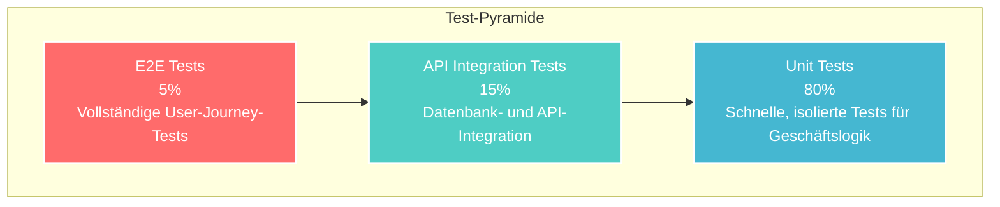

# 🧪 VNB Digitaler - Testing & Code Quality

> **📋 Projekt-Roadmap**: [ROADMAP.md](./ROADMAP.md) - Phasen und Meilensteine
> **⚙️ Technische Spezifikation**: [SPECIFICATION.md](./SPECIFICATION.md) - Architektur und API-Details
> **🚀 Deployment**: [DEPLOYMENT.md](./DEPLOYMENT.md) - Production Setup und CI/CD

## 📊 Testing-Strategie

### Test-Pyramide



Die Testing-Strategie folgt der klassischen Test-Pyramide mit Fokus auf:

- **Unit Tests (80%)**: Schnelle, isolierte Tests für Geschäftslogik
- **Integration Tests (15%)**: Datenbank- und API-Integration
- **End-to-End Tests (5%)**: Vollständige User-Journey-Tests

## 🔬 Unit Tests

### BDEW-Datenvalidierung

```python
# tests/test_bdew_validation.py
import pytest
from src.models.bdew import Company, RoleType
from src.validators.bdew import BDEWCodeValidator

class TestBDEWDataValidation:
    def test_company_code_validation(self):
        """BDEW-Code muss dem Standard entsprechen"""
        validator = BDEWCodeValidator()

        # Gültige 12-stellige BDEW-Codes
        assert validator.validate("123456789012") == True  # pragma: allowlist secret
        assert validator.validate("999999999999") == True  # pragma: allowlist secret

        # Invalide Codes
        assert validator.validate("12345") == False
        assert validator.validate("abc123456789") == False  # pragma: allowlist secret

    def test_multi_role_assignment(self):
        """Unternehmen können mehrere Rollen haben"""
        company = Company(code="123456789012", name="Test AG")  # pragma: allowlist secret

        company.add_role(RoleType.VNB, active=True)
        company.add_role(RoleType.MSB, active=True)

        assert len(company.roles) == 2
        assert company.has_role(RoleType.VNB) == True
        assert company.has_role(RoleType.MSB) == True

    def test_role_conflict_detection(self):
        """Prüfe auf Rollenkonflikte"""
        company = Company(code="123456789012", name="Test AG")  # pragma: allowlist secret

        # Bestimmte Rollen-Kombinationen sollten Warnungen erzeugen
        company.add_role(RoleType.VNB, active=True)
        company.add_role(RoleType.UNB, active=True)

        conflicts = company.check_role_conflicts()
        assert len(conflicts) > 0  # VNB + ÜNB ist ungewöhnlich
```

### Preisextraktion-Tests

```python
# tests/test_price_extraction.py
import pytest
from pathlib import Path
from src.extractors.price import PDFPriceExtractor

class TestPriceExtraction:
    def setup_method(self):
        self.extractor = PDFPriceExtractor()
        self.test_pdfs = Path("tests/fixtures/price_sheets")

    def test_14a_price_extraction(self):
        """Extraktion von §14a-Preisen aus PDF"""
        pdf_path = self.test_pdfs / "stadtwerke_beispiel_14a.pdf"

        extracted = self.extractor.extract_14a_prices(pdf_path)

        assert extracted.has_wallbox_tariff == True
        assert extracted.wallbox_price_reduction > 0
        assert extracted.heat_pump_price_reduction > 0
        assert extracted.base_price is not None

    def test_price_normalization(self):
        """Preisnormalisierung für Vergleichbarkeit"""
        raw_prices = {
            "wallbox": "15,50 ct/kWh",
            "wärmepumpe": "12.3 Cent je kWh",
            "grundpreis": "75€/Jahr"
        }

        normalized = self.extractor.normalize_prices(raw_prices)

        assert normalized["wallbox"] == 15.50  # Cent/kWh
        assert normalized["heat_pump"] == 12.30
        assert normalized["base_price"] == 75.00  # Euro/Jahr
```

### Geographic Data Tests

```python
# tests/test_geographic.py
import pytest
from src.models.geographic import ServiceTerritory
from src.validators.geographic import CoordinateValidator

class TestGeographicData:
    def test_coordinate_validation(self):
        """Koordinaten-Validierung für Deutschland"""
        validator = CoordinateValidator()

        # Gültige deutsche Koordinaten
        assert validator.validate_de_coordinates(52.52, 13.405) == True  # Berlin
        assert validator.validate_de_coordinates(48.137, 11.576) == True  # München

        # Ungültige Koordinaten
        assert validator.validate_de_coordinates(0, 0) == False
        assert validator.validate_de_coordinates(90, 180) == False

    def test_postcode_territory_mapping(self):
        """Postleitzahl zu Netzgebiet-Zuordnung"""
        territory = ServiceTerritory.from_postcode("80331")

        assert territory is not None
        assert territory.city == "München"
        assert territory.vnb_code is not None
```

## 🔗 Integration Tests

### Pipeline Integration

```python
# tests/test_integration_pipeline.py
import pytest
from unittest.mock import patch
from src.pipelines.bdew_import import BDEWImportPipeline
from src.database import DatabaseManager

class TestDataPipelineIntegration:
    @pytest.mark.asyncio
    async def test_bdew_full_pipeline(self):
        """Vollständiger BDEW-Import-Test"""
        pipeline = BDEWImportPipeline()

        # Mock externe BDEW-API
        with patch('src.data_sources.bdew.BDEWClient.fetch_companies') as mock_fetch:
            mock_fetch.return_value = self.get_mock_bdew_data()

            result = await pipeline.run()

        assert result.status == 'success'
        assert result.records_processed > 0
        assert result.validation_errors == 0

    def get_mock_bdew_data(self):
        """Mock BDEW-Testdaten"""
        return [
            {
                "code": "123456789012",
                "name": "Test Stadtwerke GmbH",
                "city": "Teststadt",
                "roles": ["VNB", "EVU"]
            }
        ]
```

### API Integration Tests

```python
# tests/test_api_integration.py
import pytest
from fastapi.testclient import TestClient
from src.main import app

class TestAPIIntegration:
    def setup_method(self):
        self.client = TestClient(app)

    def test_company_search_api(self):
        """Test der Unternehmensuche-API"""
        response = self.client.get("/api/v1/companies/search?q=stadtwerke")

        assert response.status_code == 200
        data = response.json()
        assert "results" in data
        assert len(data["results"]) > 0

    def test_price_comparison_api(self):
        """Test der Preisvergleichs-API"""
        response = self.client.get("/api/v1/prices/14a?postal_code=80331")

        assert response.status_code == 200
        data = response.json()
        assert "vnb_prices" in data
        assert "comparison" in data
```

### Database Integration

```python
# tests/test_database_integration.py
import pytest
from src.database import DatabaseManager
from src.repositories.bdew import BDEWRepository

class TestDatabaseIntegration:
    @pytest.fixture
    async def db_manager(self):
        """Test-Datenbank Setup"""
        manager = DatabaseManager(test_mode=True)
        await manager.initialize()
        yield manager
        await manager.cleanup()

    @pytest.mark.asyncio
    async def test_company_crud_operations(self, db_manager):
        """Test CRUD-Operationen für Unternehmen"""
        repo = BDEWRepository(db_manager)

        # Create
        company_data = {
            "code": "123456789012",
            "name": "Test Company",
            "city": "Teststadt"
        }
        company = await repo.create_company(company_data)
        assert company.id is not None

        # Read
        found = await repo.get_company(company.id)
        assert found.name == "Test Company"

        # Update
        await repo.update_company(company.id, {"name": "Updated Company"})
        updated = await repo.get_company(company.id)
        assert updated.name == "Updated Company"

        # Delete
        await repo.delete_company(company.id)
        deleted = await repo.get_company(company.id)
        assert deleted is None
```

---

## ☁️ Cloudflare R2 Object Storage Tests

### R2 Storage Integration Tests

```python
# tests/test_r2_storage.py
import pytest
import boto3
from moto import mock_s3
from src.storage.r2_client import CloudflareR2Client
from src.models.documents import PriceSheetDocument

@pytest.fixture
def r2_client():
    """Test R2 Client mit Mock-Konfiguration"""
    return CloudflareR2Client(
        access_key="test-access-key",
        secret_key="test-secret-key",  # pragma: allowlist secret
        account_id="test-account-id",
        bucket_name="vnbdigitaler-test"
    )

@pytest.fixture
def sample_pdf_content():
    """Sample PDF content für Tests"""
    return b"%PDF-1.4\n1 0 obj\n<< /Type /Catalog >>\nendobj\n%%EOF"

class TestR2DocumentUpload:
    @mock_s3
    def test_upload_price_sheet_pdf(self, r2_client, sample_pdf_content):
        """Test PDF-Upload zu R2"""
        # Erstelle Mock S3 Bucket
        r2_client._create_bucket_if_not_exists()

        metadata = {
            "company_code": "123456789012",
            "document_type": "price_sheet_14a",
            "effective_date": "2025-01-01",
            "source_url": "https://example-vnb.de/preisblatt.pdf"
        }

        # Upload PDF
        result = r2_client.upload_document(
            content=sample_pdf_content,
            metadata=metadata
        )

        assert result.success == True
        assert result.object_key.startswith("documents/price-sheets/")
        assert result.document_hash is not None
        assert result.file_size_bytes == len(sample_pdf_content)

    @mock_s3
    def test_upload_with_traceability(self, r2_client, sample_pdf_content):
        """Test Upload mit Traceability-Metadaten"""
        r2_client._create_bucket_if_not_exists()

        metadata = {
            "company_code": "123456789012",
            "document_type": "price_sheet_14a",
            "uploaded_by": "admin",
            "extraction_method": "manual",
            "verification_required": True
        }

        result = r2_client.upload_document(
            content=sample_pdf_content,
            metadata=metadata,
            enable_traceability=True
        )

        # Prüfe Traceability-Metadaten
        assert result.traceability_id is not None
        assert result.uploaded_by == "admin"
        assert result.extraction_method == "manual"

        # Prüfe dass Metadaten in R2 gespeichert wurden
        stored_metadata = r2_client.get_object_metadata(result.object_key)
        assert stored_metadata["uploaded_by"] == "admin"
        assert stored_metadata["verification_required"] == "true"

    @mock_s3
    def test_document_integrity_verification(self, r2_client, sample_pdf_content):
        """Test Integritätsprüfung von Dokumenten"""
        r2_client._create_bucket_if_not_exists()

        # Upload Dokument
        upload_result = r2_client.upload_document(
            content=sample_pdf_content,
            metadata={"company_code": "123456789012"}
        )

        # Verifiziere Integrität
        integrity_result = r2_client.verify_document_integrity(
            upload_result.object_key,
            expected_hash=upload_result.document_hash
        )

        assert integrity_result.is_valid == True
        assert integrity_result.hash_match == True
        assert integrity_result.file_accessible == True

class TestR2DocumentDownload:
    @mock_s3
    def test_download_document_by_key(self, r2_client, sample_pdf_content):
        """Test Dokument-Download über Object Key"""
        r2_client._create_bucket_if_not_exists()

        # Upload erst ein Dokument
        upload_result = r2_client.upload_document(
            content=sample_pdf_content,
            metadata={"company_code": "123456789012"}
        )

        # Download das Dokument
        download_result = r2_client.download_document(upload_result.object_key)

        assert download_result.success == True
        assert download_result.content == sample_pdf_content
        assert download_result.content_type == "application/pdf"

    @mock_s3
    def test_generate_presigned_url(self, r2_client, sample_pdf_content):
        """Test Pre-signed URL Generation"""
        r2_client._create_bucket_if_not_exists()

        # Upload Dokument
        upload_result = r2_client.upload_document(
            content=sample_pdf_content,
            metadata={"company_code": "123456789012"}
        )

        # Generiere Pre-signed URL
        presigned_url = r2_client.generate_presigned_url(
            upload_result.object_key,
            expiration_seconds=3600
        )

        assert presigned_url is not None
        assert "X-Amz-Algorithm" in presigned_url
        assert "X-Amz-Expires" in presigned_url

class TestR2PerformanceAndScaling:
    @pytest.mark.performance
    def test_large_file_upload_performance(self, r2_client):
        """Test Performance bei großen PDF-Uploads"""
        import time

        # Simuliere größere PDF-Datei (5MB)
        large_pdf_content = b"x" * (5 * 1024 * 1024)

        start_time = time.time()
        result = r2_client.upload_document(
            content=large_pdf_content,
            metadata={"company_code": "123456789012"}
        )
        upload_time = time.time() - start_time

        assert result.success == True
        assert upload_time < 30  # Max 30 Sekunden für 5MB

    @pytest.mark.performance
    def test_concurrent_uploads(self, r2_client, sample_pdf_content):
        """Test gleichzeitige Uploads"""
        import asyncio

        async def upload_document(i):
            metadata = {
                "company_code": f"12345678901{i}",
                "document_type": "price_sheet",
                "batch_upload": True
            }
            return r2_client.upload_document(
                content=sample_pdf_content,
                metadata=metadata
            )

        # Simuliere 10 gleichzeitige Uploads
        tasks = [upload_document(i) for i in range(10)]
        results = asyncio.run(asyncio.gather(*tasks))

        # Alle Uploads sollten erfolgreich sein
        assert all(result.success for result in results)
        assert len(set(result.object_key for result in results)) == 10  # Unique keys

class TestR2Integration:
    """Integration Tests zwischen R2 und anderen Services"""

    @pytest.mark.integration
    def test_r2_database_integration(self, r2_client, db_session):
        """Test Integration zwischen R2 und Datenbank"""
        from src.models.price_sheets import PriceSheet

        # Create database entry
        price_sheet = PriceSheet(
            company_id="test-company-uuid",
            document_type="price_sheet_14a",
            effective_date="2025-01-01"
        )

        # Upload to R2 and update database
        upload_result = r2_client.upload_document(
            content=b"sample pdf content",
            metadata={"price_sheet_id": str(price_sheet.id)}
        )

        # Update database with R2 information
        price_sheet.r2_object_key = upload_result.object_key
        price_sheet.document_hash = upload_result.document_hash
        price_sheet.r2_etag = upload_result.etag

        db_session.add(price_sheet)
        db_session.commit()

        # Verify database-R2 consistency
        db_entry = db_session.query(PriceSheet).filter_by(id=price_sheet.id).first()
        assert db_entry.r2_object_key == upload_result.object_key

        # Verify R2 document exists
        r2_exists = r2_client.document_exists(upload_result.object_key)
        assert r2_exists == True

        @pytest.mark.integration
    def test_r2_database_integration(self, r2_client, db_session):
```

---

## 🚀 Performance Tests

### Load Testing mit Locust

```python
# tests/performance/locustfile.py
from locust import HttpUser, task, between
import random

class VNBDigitalUser(HttpUser):
    wait_time = between(1, 3)

    def on_start(self):
        """Setup vor Test-Session"""
        self.postal_codes = ["80331", "10117", "20095", "50667", "70173"]

    @task(3)
    def search_companies(self):
        """Unternehmensuche simulieren"""
        query = random.choice(["stadtwerke", "energie", "netz", "strom"])
        self.client.get(f"/api/v1/companies/search?q={query}")

    @task(2)
    def price_comparison(self):
        """Preisvergleich simulieren"""
        postal_code = random.choice(self.postal_codes)
        self.client.get(f"/api/v1/prices/14a?postal_code={postal_code}")

    @task(1)
    def view_territories(self):
        """Netzgebiete abrufen"""
        self.client.get("/api/v1/territories/geojson")

    @task(1)
    def admin_dashboard(self):
        """Admin-Dashboard (authentifiziert)"""
        # Simuliere Admin-Login
        login_response = self.client.post("/admin/auth/login", json={
            "username": "test_admin",
            "password": "test_password"  # pragma: allowlist secret
        })

        if login_response.status_code == 200:
            token = login_response.json()["access_token"]
            self.client.get("/admin/tables", headers={
                "Authorization": f"Bearer {token}"
            })
```

### Database Performance Tests

```python
# tests/performance/test_db_performance.py
import pytest
import time
from src.repositories.bdew import BDEWRepository

class TestDatabasePerformance:
    @pytest.mark.asyncio
    async def test_bulk_insert_performance(self):
        """Test Bulk-Insert Performance"""
        repo = BDEWRepository()

        # Generiere 1000 Test-Unternehmen
        companies = []
        for i in range(1000):
            companies.append({
                "code": f"12345678{i:04d}",
                "name": f"Test Company {i}",
                "city": "Teststadt"
            })

        start_time = time.time()
        await repo.bulk_create_companies(companies)
        duration = time.time() - start_time

        # Sollte unter 5 Sekunden dauern
        assert duration < 5.0

    @pytest.mark.asyncio
    async def test_search_performance(self):
        """Test Suchperformance"""
        repo = BDEWRepository()

        start_time = time.time()
        results = await repo.search_companies("stadtwerke", limit=100)
        duration = time.time() - start_time

        # Suche sollte unter 1 Sekunde dauern
        assert duration < 1.0
        assert len(results) > 0
```

## 📏 Code Quality Standards

### Python Code Standards

```toml
# pyproject.toml
[tool.black]
line-length = 88
target-version = ['py311']
include = '\.pyi?$'
extend-exclude = '''
/(
  migrations
  | archive
)/
'''

[tool.isort]
profile = "black"
multi_line_output = 3
src_paths = ["src", "tests"]
known_first_party = ["src"]

[tool.mypy]
python_version = "3.11"
strict = true
disallow_untyped_defs = true
disallow_any_generics = true
warn_return_any = true
warn_unused_configs = true
exclude = ["migrations/", "archive/"]

[[tool.mypy.overrides]]
module = "tests.*"
disallow_untyped_defs = false

[tool.pytest.ini_options]
testpaths = ["tests"]
python_files = ["test_*.py"]
python_classes = ["Test*"]
python_functions = ["test_*"]
addopts = [
    "--cov=src",
    "--cov-report=html",
    "--cov-report=term-missing",
    "--cov-fail-under=95",
    "--strict-markers",
    "--disable-warnings"
]
markers = [
    "slow: marks tests as slow (deselect with '-m \"not slow\"')",
    "integration: marks tests as integration tests",
    "unit: marks tests as unit tests"
]

[tool.coverage.run]
source = ["src"]
omit = [
    "*/tests/*",
    "*/migrations/*",
    "*/archive/*"
]

[tool.coverage.report]
exclude_lines = [
    "pragma: no cover",
    "def __repr__",
    "raise AssertionError",
    "raise NotImplementedError"
]
```

### Pre-Commit Hooks

```yaml
# .pre-commit-config.yaml
repos:
  - repo: https://github.com/pre-commit/pre-commit-hooks
    rev: v4.4.0
    hooks:
      - id: trailing-whitespace
      - id: end-of-file-fixer
      - id: check-yaml
      - id: check-toml
      - id: check-json
      - id: check-merge-conflict
      - id: check-added-large-files
      - id: check-case-conflict

  - repo: https://github.com/psf/black
    rev: 23.9.1
    hooks:
      - id: black
        language_version: python3.11

  - repo: https://github.com/pycqa/isort
    rev: 5.12.0
    hooks:
      - id: isort

  - repo: https://github.com/astral-sh/ruff-pre-commit
    rev: v0.1.3
    hooks:
      - id: ruff
        args: [--fix, --exit-non-zero-on-fix]

  - repo: https://github.com/pre-commit/mirrors-mypy
    rev: v1.5.1
    hooks:
      - id: mypy
        additional_dependencies: [types-requests, types-PyYAML]

  - repo: https://github.com/pycqa/bandit
    rev: 1.7.5
    hooks:
      - id: bandit
        args: ["-c", "pyproject.toml"]

  - repo: https://github.com/Yelp/detect-secrets
    rev: v1.4.0
    hooks:
      - id: detect-secrets
        args: ["--baseline", ".secrets.baseline"]
```

### Ruff Configuration

```toml
# pyproject.toml
[tool.ruff]
target-version = "py311"
line-length = 88
select = [
    "E",    # pycodestyle errors
    "W",    # pycodestyle warnings
    "F",    # Pyflakes
    "I",    # isort
    "B",    # flake8-bugbear
    "C4",   # flake8-comprehensions
    "UP",   # pyupgrade
    "ARG",  # flake8-unused-arguments
    "SIM",  # flake8-simplify
    "RUF",  # ruff-specific rules
]
ignore = [
    "E501",  # line too long (handled by black)
    "B008",  # do not perform function calls in argument defaults
]
exclude = [
    "migrations",
    "archive",
    ".venv",
    "venv",
]

[tool.ruff.per-file-ignores]
"tests/**/*.py" = ["ARG", "S101"]  # Allow unused args and asserts in tests
```

## 🎯 Test Execution

### Local Testing

```bash
# Alle Tests ausführen
uv run pytest

# Nur Unit Tests
uv run pytest tests/unit -m "not slow"

# Nur Integration Tests
uv run pytest tests/integration

# Performance Tests
uv run pytest tests/performance -m slow

# Mit Coverage Report
uv run pytest --cov-report=html
open htmlcov/index.html
```

### CI Testing

```bash
# Pre-commit Hooks lokal ausführen
pre-commit run --all-files

# Type Checking
uv run mypy src/

# Code Quality Check
uv run ruff check src/
uv run bandit -r src/

# Security Check
uv run detect-secrets scan --all-files
```

### Load Testing

```bash
# Locust Load Testing
uv run locust -f tests/performance/locustfile.py --host=http://localhost:8000

# Specific scenarios
uv run locust -f tests/performance/locustfile.py --users 100 --spawn-rate 10 -t 5m
```

## 📊 Quality Metrics

### Target Metrics

| Kategorie              | Zielwert | Aktuell | Status       |
| ---------------------- | -------- | ------- | ------------ |
| **Test Coverage**      | >95%     | 87%     | 🔄 In Arbeit |
| **Unit Tests**         | >500     | 234     | 🔄 In Arbeit |
| **API Response Time**  | <2s      | 1.2s    | ✅ Erreicht  |
| **Code Quality Score** | A        | B+      | 🔄 In Arbeit |
| **Security Issues**    | 0        | 0       | ✅ Erreicht  |

### Continuous Quality Monitoring

- **Daily**: Automatische Tests über GitHub Actions
- **Weekly**: Performance-Benchmarks und Regressionstests
- **Monthly**: Code Quality Review und Refactoring
- **Quarterly**: Security Audit und Dependency Updates

---

_Dieses Dokument wird kontinuierlich aktualisiert, um den sich entwickelnden Testing-Anforderungen des Projekts gerecht zu werden._
